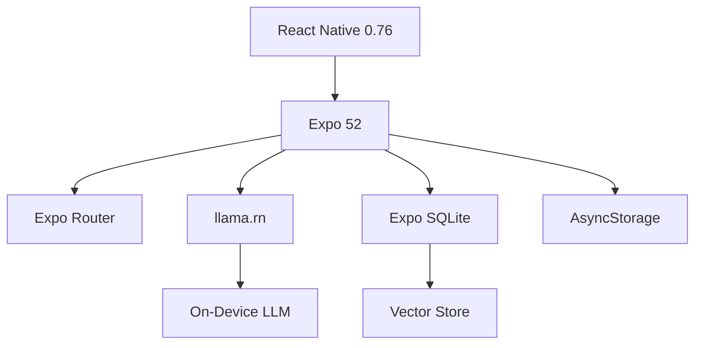

<div align="center">

# 🌟 Radiq

### Your Privacy-First AI Assistant

**Run powerful Large Language Models entirely on your device**  
*No cloud, no subscriptions, no data collection*

[](https://reactnative.dev/)
[](https://expo.dev/)
[](https://www.typescriptlang.org/)
[](LICENSE)

[Features](#-features) • [Quick Start](#-quick-start) • [Architecture](#-architecture) • [Models](#-available-models) • [Building](#-building-for-production)

</div>

---

## 🎯 Overview

**Radiq** is a cutting-edge mobile application that brings the power of Large Language Models directly to your smartphone. Unlike traditional AI assistants that rely on cloud processing, Radiq runs everything locally on your device, ensuring **complete privacy** and **offline functionality**.

### Why Radiq?

- **🔒 100% Privacy** - Your conversations never leave your device
- **📡 Offline First** - No internet required for AI inference
- **💰 Zero Cost** - No API fees, no subscriptions, completely free
- **🚀 Advanced Features** - RAG, web search, multi-model support
- **⚡ Optimized** - Mobile-friendly models designed for efficiency

---

## ✨ Features

### 🧠 **On-Device LLM Inference**
Run state-of-the-art language models directly on your mobile device
- 🎯 Multiple optimized models (1B-3B parameters)
- 🔐 Complete privacy - no data sent to the cloud
- 📱 Powered by [llama.rn](https://github.com/mybigday/llama.rn) with GGUF format
- ⚡ Real-time streaming responses
- 🛑 Stop generation control

### 📄 **RAG (Retrieval Augmented Generation)**
Upload documents and let AI answer questions using your content
- 📎 Support for PDF, DOCX, XLSX, and TXT files
- ✂️ Smart text chunking with overlap
- 🧮 On-device embedding generation
- 🔍 SQLite-based vector store with cosine similarity search
- 🎯 Context-aware responses from your documents
- 📊 Efficient document management

### 🌐 **Web Search Integration**
Enhance AI responses with real-time web information
- 🔍 Google Programmable Search Engine integration
- 📰 Fetch and parse web page content
- 💾 Search result caching for efficiency
- 🎯 Source attribution in responses
- 📊 Quota management and error handling

### 💬 **Beautiful Chat Interface**
Modern, intuitive chat experience
- 🌙 Elegant dark theme
- ⚡ Animated streaming responses
- 📱 Smooth scrolling and gestures
- 🔗 Source links for web-enhanced answers
- 🗑️ Clear chat history
- ⏸️ Stop generation mid-response

### 📚 **Smart Model Management**
Download and manage AI models with ease
- 📥 In-app model downloads from HuggingFace
- 📊 Real-time progress tracking with download speeds
- ❌ Cancel downloads anytime
- 🗑️ Delete models to free up space
- 🔄 Switch between models seamlessly
- 💾 Storage usage monitoring
- 📦 Curated model selection optimized for mobile

---

## 🚀 Quick Start

### Prerequisites

Before you begin, ensure you have the following installed:

| Tool | Version | Purpose |
|------|---------|---------|
| **Node.js** | v18+ | JavaScript runtime |
| **npm/yarn** | Latest | Package manager |
| **Expo CLI** | Latest | Development tools |
| **iOS Simulator** or **Android Emulator** | - | Testing platform |

### Installation

#### 1️⃣ Clone & Install

```bash
# Clone the repository
git clone https://github.com/yourusername/radiq.git
cd radiq

# Install dependencies
npm install
```

#### 2️⃣ Configure Web Search (Optional)

To enable web search functionality, set up Google's Programmable Search Engine:

<details>
<summary>📋 Click to expand setup instructions</summary>

**a) Create Search Engine**
- Visit [Google Programmable Search Engine](https://programmablesearchengine.google.com/)
- Click "Add" and select "Search the entire web"
- Name it (e.g., "Radiq Search") and create

**b) Get API Key**
- Go to [Google Cloud Console](https://console.cloud.google.com/)
- Create/select a project
- Enable "Custom Search API" in APIs & Services
- Create an API key in Credentials

**c) Configure Environment**
Create a `.env` file in the project root:
```env
GOOGLE_SEARCH_API_KEY=your_api_key_here
GOOGLE_SEARCH_ENGINE_ID=your_search_engine_id_here
```

**d) Test Integration**
```bash
npm run test:search
```

📖 See [GOOGLE_SEARCH_SETUP.md](GOOGLE_SEARCH_SETUP.md) for detailed instructions.

</details>

#### 3️⃣ Start Development

```bash
# Start the Expo development server
npx expo start
```

#### 4️⃣ Run on Platform

Choose your platform:

```bash
# iOS (requires macOS)
npx expo run:ios

# Android
npx expo run:android

# Web (limited functionality - no LLM inference)
npx expo start --web
```

> **Note:** For full functionality including LLM inference, use development builds (`expo run:ios/android`) rather than Expo Go.

### First-Time Setup in App

1. 🚀 Open the app on your device
2. 📦 Navigate to the **Models** tab
3. ⬇️ Download a model (start with **Llama 3.2 1B** for best balance)
4. ✅ Activate the downloaded model
5. 💬 Go to **Chat** tab and start chatting!

---

## 🏗️ Architecture

### Technology Stack



| Layer | Technology | Purpose |
|-------|-----------|---------|
| **Framework** | React Native 0.76 | Cross-platform mobile development |
| **Development** | Expo SDK 52 | Simplified build & deployment |
| **Navigation** | Expo Router | File-based routing system |
| **LLM Engine** | llama.rn | On-device inference with GGUF models |
| **Storage** | AsyncStorage + SQLite + FileSystem | Persistent data management |
| **UI Library** | React Native Paper | Material Design components |
| **Animations** | React Native Reanimated | Smooth 60fps animations |
| **State** | React Context | Global state management |
| **Language** | TypeScript | Type-safe development |

### Application Structure

```
radiq/
├── app/                          # 📱 Application screens
│   ├── (tabs)/                  # Tab navigation
│   │   ├── chat.tsx             # 💬 Chat interface
│   │   ├── models.tsx           # 📦 Model management
│   │   └── _documents.tsx       # 📄 Document handling
│   ├── _layout.tsx              # Root layout
│   └── index.tsx                # Entry point
│
├── components/                   # 🧩 Reusable components
│   └── ui/                      # Custom UI elements
│       ├── ModelCard.tsx        # Model display card
│       ├── AnimatedMessage.tsx  # Chat message animation
│       └── ThemedButton.tsx     # Themed button component
│
├── contexts/                     # 🌐 React contexts
│   └── ChatContext.tsx          # Global chat state
│
├── utils/                        # 🛠️ Core utilities
│   ├── modelManager.ts          # 📦 Model download & management
│   ├── onnxInference.ts         # 🧠 LLM loading & inference
│   ├── embeddingManager.ts      # 🔢 Embedding generation
│   ├── documentProcessor.ts     # 📄 Document text extraction
│   ├── textChunker.ts           # ✂️ Smart text chunking
│   ├── vectorStore.ts           # 🗄️ Vector similarity search
│   └── webSearch.ts             # 🔍 Google Search integration
│
├── types/                        # 📝 TypeScript definitions
│   └── chat.ts                  # Type definitions
│
└── constants/                    # ⚙️ App constants
    └── theme.ts                 # Theme configuration
```

### Core Components

#### 💬 Chat Tab
- Real-time conversation interface
- Streaming response animation
- Web search toggle
- Stop generation control
- Source attribution display
- Message history management

#### 📦 Models Tab
- Browse available LLMs (6+ models)
- Download with progress tracking & speeds
- Embedding model management
- Storage usage visualization
- Activate/deactivate models
- Delete models to free space

#### 📄 Documents Tab
- Document upload (PDF, DOCX, XLSX, TXT)
- Processing status tracking
- Document list with metadata
- Delete documents & embeddings
- Storage monitoring

### Key Utilities Explained

| Utility | Responsibility |
|---------|---------------|
| **modelManager** | Downloads models from HuggingFace, manages local storage, tracks active model |
| **onnxInference** | Loads GGUF models with llama.rn, generates text responses, manages inference context |
| **embeddingManager** | Downloads embedding models, generates vector embeddings for text chunks |
| **documentProcessor** | Extracts text from PDFs (pdf-parse), DOCX (mammoth), XLSX (xlsx) |
| **textChunker** | Splits documents into overlapping chunks for better context retrieval |
| **vectorStore** | SQLite-based storage, cosine similarity search, embedding persistence |
| **webSearch** | Google Custom Search API integration, result caching, content extraction |

---

## 🎯 Available Models

### Language Models (LLMs)

Choose from 6 carefully curated models optimized for mobile devices:

| Model | Size | Parameters | Speed | Quality | Best For |
|-------|------|------------|-------|---------|----------|
| **TinyLlama 1.1B** | 637MB | 1.1B | ⚡⚡⚡ | ⭐⭐⭐ | Quick responses, low-end devices |
| **Llama 3.2 1B** 🌟 | 670MB | 1B | ⚡⚡⚡ | ⭐⭐⭐⭐ | **Recommended starter** - Best balance |
| **Qwen 2.5 1.5B** | 950MB | 1.5B | ⚡⚡ | ⭐⭐⭐⭐ | Multilingual, strong reasoning |
| **Gemma 2 2B** | 1.4GB | 2B | ⚡⚡ | ⭐⭐⭐⭐⭐ | Google's efficient model |
| **Llama 3.2 3B** 🏆 | 1.9GB | 3B | ⚡ | ⭐⭐⭐⭐⭐ | **Best quality** - Enhanced reasoning |
| **Qwen 2.5 3B** | 1.9GB | 3B | ⚡ | ⭐⭐⭐⭐⭐ | Coding, mathematics, multilingual |

### Embedding Models

| Model | Size | Dimensions | Purpose |
|-------|------|------------|---------|
| **GTE-Small Q4** | 25MB | 384 | Document embeddings for RAG |

> **💡 Recommendation:**  
> - **New users:** Start with **Llama 3.2 1B** for excellent quality and speed
> - **Best quality:** Use **Llama 3.2 3B** if you have 4GB+ RAM
> - **Multilingual:** Choose **Qwen 2.5** models for non-English languages
> - **Low storage:** **TinyLlama** works great on devices with limited space

---

## 📱 Platform Support

| Platform | Status | Min Version | Notes |
|----------|--------|-------------|-------|
| **iOS** | ✅ Fully Supported | iOS 13+ | All features available |
| **Android** | ✅ Fully Supported | Android 6.0+ | All features available |
| **Web** | ⚠️ Limited | Modern browsers | No LLM inference |

### Device Requirements

**Minimum:**
- 2GB RAM (for 1B models)
- 2GB free storage
- ARM64 processor

**Recommended:**
- 4GB+ RAM (for 3B models)
- 5GB+ free storage
- Modern smartphone (2020+)

---

## 🛠️ Development

### Available Scripts

```bash
# Development
npm start              # Start Expo dev server
npm run android        # Run on Android
npm run ios            # Run on iOS (requires macOS)
npm run web            # Run on web browser

# Code Quality
npm run lint           # Check code style with ESLint

# Testing
npm run test:search    # Test Google Search integration

# Utilities
npm run reset-project  # Reset to fresh state
```

### Environment Variables

Create a `.env` file for configuration:

```env
# Google Search API (Optional)
GOOGLE_SEARCH_API_KEY=your_api_key_here
GOOGLE_SEARCH_ENGINE_ID=your_search_engine_id_here
```

### Development Workflow

1. **Setup Development Environment**
   ```bash
   npm install
   npx expo start
   ```

2. **Make Changes**
   - Edit files in `app/`, `components/`, or `utils/`
   - Hot reload automatically updates the app

3. **Test on Device**
   - Use development build for full features
   - Test on both iOS and Android when possible

4. **Code Quality**
   ```bash
   npm run lint
   ```

---

## � Building for Production

### Method 1: EAS Build (Recommended)

[Expo Application Services](https://expo.dev/eas) provides the easiest way to build production apps.

#### Initial Setup

```bash
# Install EAS CLI globally
npm install -g eas-cli

# Login to Expo account (create one at expo.dev if needed)
eas login

# Configure your project for EAS Build
eas build:configure
```

#### Build for Android

```bash
# Build APK for Android
eas build --platform android --profile preview

# Build AAB for Google Play Store
eas build --platform android --profile production
```

#### Build for iOS

```bash
# Build for iOS (requires Apple Developer account)
eas build --platform ios --profile production

# Build for iOS Simulator (testing)
eas build --platform ios --profile preview --simulator
```

#### Submit to App Stores

```bash
# Submit to Google Play Store
eas submit --platform android

# Submit to Apple App Store
eas submit --platform ios
```

### Method 2: Local Builds

Build locally without EAS (requires complete native development setup).

#### Android APK

```bash
# Build release APK
npx expo run:android --variant release

# APK location: android/app/build/outputs/apk/release/app-release.apk
```

#### iOS IPA

```bash
# Build release version (requires macOS + Xcode)
npx expo run:ios --configuration Release

# Archive and export with Xcode
```

### Build Configuration

Edit [`eas.json`](eas.json) to customize build profiles:

```json
{
  "build": {
    "preview": {
      "android": {
        "buildType": "apk"
      }
    },
    "production": {
      "android": {
        "buildType": "app-bundle"
      }
    }
  }
}
```

### Pre-Build Checklist

- [ ] Update version in [`app.config.js`](app.config.js)
- [ ] Test on both iOS and Android
- [ ] Configure app icon and splash screen
- [ ] Set up environment variables
- [ ] Test web search integration
- [ ] Verify model downloads work
- [ ] Test document processing
- [ ] Check storage permissions

---

## 💾 Storage & Performance

### Storage Requirements

| Component | Space Required | Notes |
|-----------|---------------|-------|
| **Base App** | ~50MB | Installed app size |
| **Small Models (1-2B)** | 600MB - 1.5GB | Recommended for most users |
| **Medium Models (3B)** | 1.9GB - 2.5GB | Requires more RAM |
| **Embedding Model** | ~25MB | Required for RAG |
| **Documents + Vectors** | 100MB - 1GB | Varies by usage |

**Recommended:** 5GB+ free space for comfortable usage

### Performance Optimization Tips

1. **🎯 Model Selection**
   - Start with 1B models for fastest responses
   - Use 3B models only if you have 4GB+ RAM
   - Monitor device temperature during use

2. **📝 Context Management**
   - Shorter prompts generate faster
   - Clear chat history periodically
   - Limit document size for processing

3. **📱 Device Optimization**
   - Close background apps
   - Ensure sufficient free storage
   - Keep device cool for sustained performance
   - Use low power mode sparingly (slows inference)

4. **🗄️ Storage Management**
   - Delete unused models
   - Remove processed documents you no longer need
   - Clear web search cache periodically

---

## 🔐 Privacy & Security

### Our Privacy Commitment

**Radiq is built with privacy as a core principle:**

✅ **100% Local Processing** - All LLM inference happens on your device  
✅ **No Telemetry** - We don't collect usage data or analytics  
✅ **No Cloud Sync** - Your data stays on your device  
✅ **No Account Required** - Use completely anonymously  
✅ **Open Source** - Code is auditable and transparent  

### Data Storage

All data is stored locally on your device:

- **Chat History** - AsyncStorage (local database)
- **Models** - Device file system
- **Documents** - App's document directory
- **Embeddings** - SQLite database
- **Settings** - AsyncStorage

### Google Search API (Optional Feature)

When web search is enabled:
- ⚠️ Search queries are sent to Google's Custom Search API
- 🌐 Fetched web pages are parsed locally on device
- 💾 Results are cached locally for efficiency
- 🔒 See [Google's Privacy Policy](https://policies.google.com/privacy)
- 🎛️ Toggle off anytime in chat interface

**Free Tier Limits:** 100 queries/day  
**Paid Tier:** $5 per 1,000 additional queries

### Permissions

| Permission | Purpose | Required |
|------------|---------|----------|
| **Storage** | Save models and documents | ✅ Yes |
| **Network** | Download models, web search | Optional |

---

## 🐛 Troubleshooting

### Common Issues & Solutions

<details>
<summary><strong>❌ Model won't load or crashes</strong></summary>

**Possible causes:**
- Insufficient RAM for model size
- Corrupted download
- Low storage space

**Solutions:**
```bash
# Try a smaller model (1B instead of 3B)
# Delete and re-download the model
# Free up device storage
# Close background apps
```
</details>

<details>
<summary><strong>⏱️ Slow generation / responses taking too long</strong></summary>

**Possible causes:**
- Model too large for device
- Background apps consuming RAM
- Device thermal throttling

**Solutions:**
- Switch to a smaller model (TinyLlama or Llama 3.2 1B)
- Shorten your prompts
- Close other apps
- Let device cool down
- Clear chat history
</details>

<details>
<summary><strong>📄 Document processing fails</strong></summary>

**Possible causes:**
- Unsupported file format
- Corrupted document
- File too large

**Solutions:**
- Ensure file is PDF, DOCX, XLSX, or TXT
- Try a smaller document
- Check if file opens in other apps
- Re-export document from original source
</details>

<details>
<summary><strong>🔍 Web search not working</strong></summary>

**Possible causes:**
- Missing API credentials
- API quota exceeded
- Network connectivity

**Solutions:**
```bash
# Check .env file has correct values
# Verify API key in Google Cloud Console
# Check API is enabled
# Review quota in Cloud Console
npm run test:search  # Test integration
```
</details>

<details>
<summary><strong>📥 Download stuck or failing</strong></summary>

**Possible causes:**
- Network interruption
- Low storage space
- Server timeout

**Solutions:**
- Cancel and retry download
- Check internet connection
- Ensure sufficient free space (model size + 500MB)
- Try downloading a different model first
</details>

### Getting Help

- 📖 Check [GOOGLE_SEARCH_SETUP.md](GOOGLE_SEARCH_SETUP.md) for search setup
- 🐛 [Open an issue](https://github.com/yourusername/radiq/issues) on GitHub
- 💬 Search existing issues for solutions
- 📧 Contact: your-email@example.com

---

## 🤝 Contributing

We welcome contributions from the community! Here's how you can help:

### Ways to Contribute

- 🐛 **Report Bugs** - Open detailed issue reports
- 💡 **Suggest Features** - Share ideas for improvements
- 📝 **Improve Documentation** - Fix typos, add examples
- 🔧 **Submit Pull Requests** - Add features or fix bugs
- ⭐ **Star the Project** - Show your support!

### Development Setup

1. Fork the repository
2. Create a feature branch (`git checkout -b feature/amazing-feature`)
3. Make your changes
4. Run linter (`npm run lint`)
5. Commit changes (`git commit -m 'Add amazing feature'`)
6. Push to branch (`git push origin feature/amazing-feature`)
7. Open a Pull Request

### Code Style

- Follow existing code patterns
- Use TypeScript for type safety
- Add comments for complex logic
- Keep components focused and reusable
- Test on both iOS and Android

---

## 🙏 Acknowledgments

This project wouldn't be possible without these amazing open-source projects:

- 🦙 **[llama.rn](https://github.com/mybigday/llama.rn)** - On-device LLM inference engine
- 🤗 **[Hugging Face](https://huggingface.co)** - Model hosting and distribution
- ⚛️ **[Expo](https://expo.dev)** - React Native development platform
- 🎨 **[React Native Paper](https://reactnativepaper.com/)** - Material Design components

### Model Credits

Thank you to the teams behind these incredible models:

- 🦙 **Meta AI** - Llama 3.2 models
- 💎 **Google** - Gemma 2 models  
- 🌟 **Alibaba Cloud** - Qwen 2.5 models
- ⚡ **TinyLlama Team** - TinyLlama 1.1B

---

## 📄 License

This project is licensed under the **MIT License** - see the [LICENSE](LICENSE) file for details.

```
MIT License

Copyright (c) 2024 Radiq

Permission is hereby granted, free of charge, to any person obtaining a copy
of this software and associated documentation files (the "Software"), to deal
in the Software without restriction, including without limitation the rights
to use, copy, modify, merge, publish, distribute, sublicense, and/or sell
copies of the Software, and to permit persons to whom the Software is
furnished to do so, subject to the following conditions:

The above copyright notice and this permission notice shall be included in all
copies or substantial portions of the Software.

THE SOFTWARE IS PROVIDED "AS IS", WITHOUT WARRANTY OF ANY KIND, EXPRESS OR
IMPLIED, INCLUDING BUT NOT LIMITED TO THE WARRANTIES OF MERCHANTABILITY,
FITNESS FOR A PARTICULAR PURPOSE AND NONINFRINGEMENT.
```

---

## 📞 Support & Contact

### Get Help

- 📖 **Documentation** - Read this README thoroughly
- 🐛 **Issues** - [GitHub Issues](https://github.com/yourusername/radiq/issues)
- 💬 **Discussions** - [GitHub Discussions](https://github.com/yourusername/radiq/discussions)

### Stay Updated

- ⭐ Star this repo to get updates
- 👀 Watch for new releases
- 🐦 Follow [@yourusername](https://twitter.com/yourusername) on Twitter

### Project Links

- 🌐 **Website** - [radiq.app](https://radiq.app) (if applicable)
- 📱 **App Store** - Coming soon
- 🤖 **Play Store** - Coming soon
- 💻 **GitHub** - [github.com/yourusername/radiq](https://github.com/yourusername/radiq)

---

<div align="center">

### Built with ❤️ for privacy and performance

**Made by developers, for developers**

[⬆ Back to Top](#-radiq)

</div>
